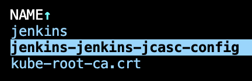
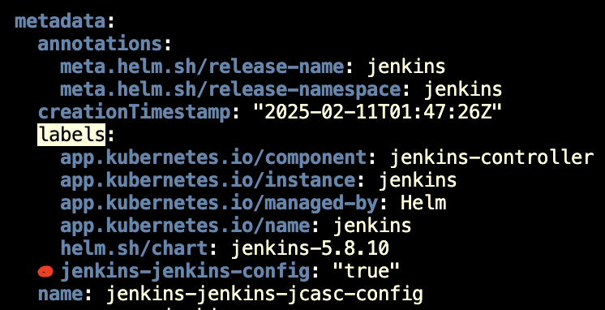

# JCasC

I want to make the config auto reload to scan JCasC in configmap instead of puting it directly inside helm values file.

The jenkins use the [kiwigrid/k8s-sidecar](https://github.com/kiwigrid/k8s-sidecar) to enable auto reload

Finding the sidecar will scan the configmaps by [LABEL](https://github.com/kiwigrid/k8s-sidecar/blob/182ed019df9c96326a2808b41ed5c5229281e855/README.md?plain=1#L68)

Inside the jenkins helm template I found this line configuring sidecar <https://github.com/jenkinsci/helm-charts/blob/27ce56f8d366e4759b07d24183352fc0e381c0ba/charts/jenkins/templates/jenkins-controller-statefulset.yaml#L320C14-L320C43>

This lead into this helper file <https://github.com/jenkinsci/helm-charts/blob/27ce56f8d366e4759b07d24183352fc0e381c0ba/charts/jenkins/templates/_helpers.tpl#L606>

Where I found the value of the LABEL is <https://github.com/jenkinsci/helm-charts/blob/27ce56f8d366e4759b07d24183352fc0e381c0ba/charts/jenkins/templates/_helpers.tpl#L626>

`"{{ template "jenkins.fullname" $root }}-jenkins-config"`

So taking a look into existing configmap that used by the sidecar I'm seeing

