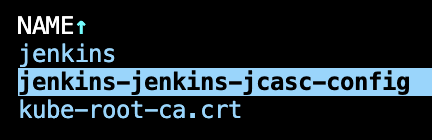
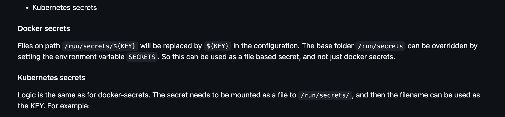
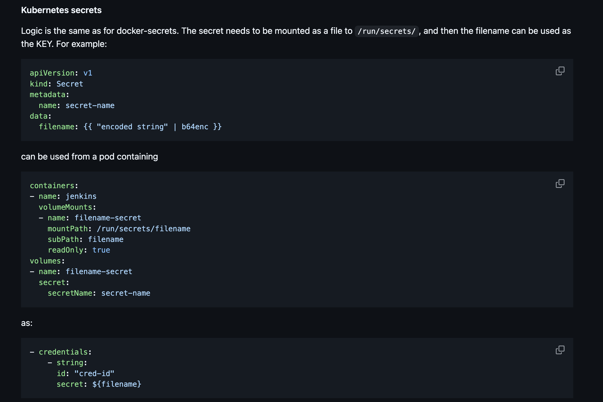

# JCasC

This is the JCasC folder inside jenkins master `/var/jenkins_home/casc_configs`

## How to configure `authorizationStrategy`

https://github.com/jenkinsci/matrix-auth-plugin/blob/50ec01b320a33d7eb2d649bd40bcc97221f50a79/src/test/resources/org/jenkinsci/plugins/matrixauth/integrations/casc/configuration-as-code-v3.yml#L1

## How I found the annotation for auto pickup the config map for jenkins JCasC

I want to make the config auto reload to scan JCasC in configmap instead of puting it directly inside helm values file.

The jenkins use the [kiwigrid/k8s-sidecar](https://github.com/kiwigrid/k8s-sidecar) to enable auto reload

Finding the sidecar will scan the configmaps by [LABEL](https://github.com/kiwigrid/k8s-sidecar/blob/182ed019df9c96326a2808b41ed5c5229281e855/README.md?plain=1#L68)

Inside the jenkins helm template I found this line configuring sidecar <https://github.com/jenkinsci/helm-charts/blob/27ce56f8d366e4759b07d24183352fc0e381c0ba/charts/jenkins/templates/jenkins-controller-statefulset.yaml#L320C14-L320C43>

This lead into this helper file <https://github.com/jenkinsci/helm-charts/blob/27ce56f8d366e4759b07d24183352fc0e381c0ba/charts/jenkins/templates/_helpers.tpl#L606>

Where I found the value of the LABEL is <https://github.com/jenkinsci/helm-charts/blob/27ce56f8d366e4759b07d24183352fc0e381c0ba/charts/jenkins/templates/_helpers.tpl#L626>

`"{{ template "jenkins.fullname" $root }}-jenkins-config"`

So taking a look into existing configmap that used by the sidecar I'm seeing

## How I config google-login and found the way to inject secrets into JCasC

JCasC secrets can be passed using variable

https://github.com/jenkinsci/configuration-as-code-plugin/blob/d6a1291bcdfa50eab8f938ae9c33a3a8fbe5488a/docs/features/secrets.adoc#passing-secrets-through-variables

JCasC secrets with Jenkins running in k8s can be taken from this path /run/secrets/${filename}, or overrided by `SECRETS` env variable

https://github.com/jenkinsci/configuration-as-code-plugin/blob/d6a1291bcdfa50eab8f938ae9c33a3a8fbe5488a/docs/features/secrets.adoc#kubernetes-secrets

Example usage with k8s secrets

https://github.com/jenkinsci/configuration-as-code-plugin/blob/d6a1291bcdfa50eab8f938ae9c33a3a8fbe5488a/docs/features/secrets.adoc#docker-secrets

Jenkins helm chart set `SECRETS` env at `/run/secrets/additional`

https://github.com/jenkinsci/helm-charts/blob/018948716bf31ff168e54a62eba504712010eb21/charts/jenkins/templates/jenkins-controller-statefulset.yaml#L217

is set up here

https://github.com/jenkinsci/helm-charts/blob/018948716bf31ff168e54a62eba504712010eb21/charts/jenkins/templates/jenkins-controller-statefulset.yaml#L310

and pattern is name `path: {{ tpl $value.name $ }}-{{ tpl $value.keyName $ }}`

https://github.com/jenkinsci/helm-charts/blob/018948716bf31ff168e54a62eba504712010eb21/charts/jenkins/templates/jenkins-controller-statefulset.yaml#L383

