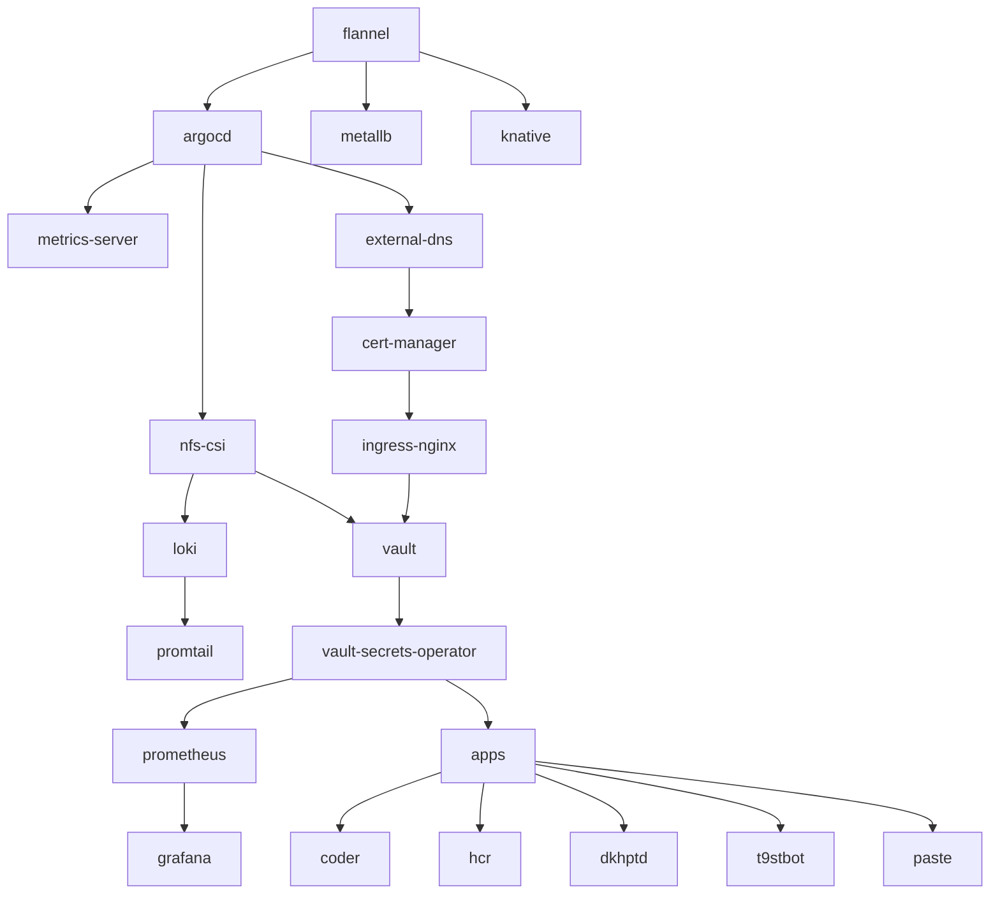

# platform

tuana9a's platform
- configuration as code (asnible)
- infrastructure as code (terraform)
- deploy apps (argocd)
- infra (aws, proxmox)
- dns, cdn, web (cloudflare)
- load balancer, reverse proxy (haproxy, nginx)

# order



# gcloud

setup `gcloud` cli auth

```
gcloud auth application-default login
```

# ansible

NOTE: using python of the os, change the 3.10 if necessary

```bash
sudo -i
apt install -y python3.10-venv
mkdir -p /opt/ansible
cd /opt/ansible
python3 -m venv .venv
source .venv/bin/activate
pip install ansible ansible-core ansible-lint
ln -sf /opt/ansible/.venv/bin/ansible* /usr/local/bin
```

verify ansible installation

```bash
ansible --version
```

config ansible vault password (optional)

```bash
vim ~/.ansible.cfg
```

```conf
[defaults]
vault_password_file=/path/to/pasword/file
```

read ansible vault password from (hashicorp) vault

```bash
vault kv get -format=json kv/platform/ansible-vault | jq -r ".data.password"
```
