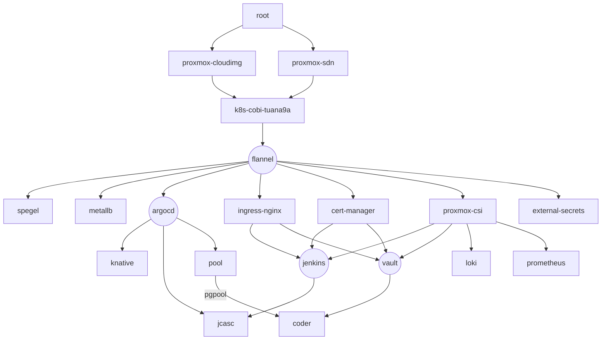

# platform

tuana9a's platform

- `ansible`: configuration as code
- `terraform`: infrastructure as code
- `github`: code, `github-workflow`: cicd
- `Jenkins`: cicd
- `argocd`: cd
- `aws`
- `gcp`: terraform state
- `proxmox`
- `cloudflare`: dns, cdn, web, r2
- `haproxy`: lb
- `nginx`: ingress, lb, web
- `vault`: secret manager
- `knative`: serverless
- `k8s`: infra
- `flannel`: k8s cni
- `metallb`: k8s lb
- `vm`: stuffs
- `cert-manager`: manage ssl
- `grafana`, `prometheus`, `loki`: monitoring
- `coder`: vscode server
- `digitalcoean`: not yet
- `docker`

# graph

