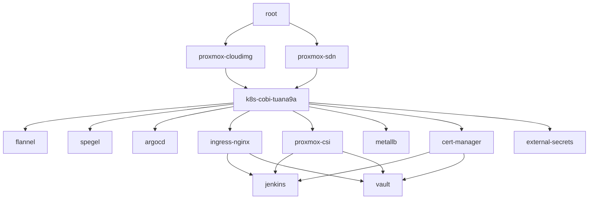
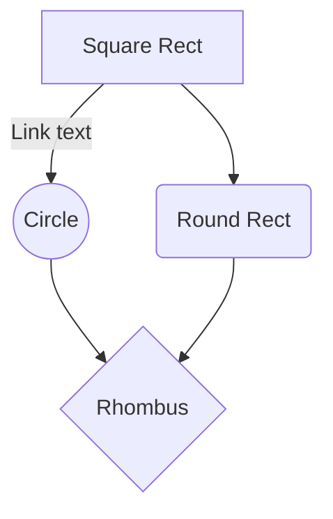

# platform

tuana9a's platform

- `ansible`: configuration as code
- `terraform`: infrastructure as code
- `github`: code
  - `github-workflow`: cicd
- `Jenkins`: cicd
- `argocd`: cd
- `aws`
- `gcp`
  - `bucket`: terraform state
- `proxmox`
- `cloudflare`: dns, cdn, web
  - `r2`: buckets
  - `pages`: web
- `haproxy`: lb
- `nginx`: ingress, lb, web
- `vault`: secret manager
- `knative`: serverless
- `k8s`: mostly infra
- `cert-manager`: manage ssl combined with ingress nginx
- `grafana`
- `prometheus`
- `loki`
- `coder`: vscode server in k8s
- `digitalcoean`: not yet
- `docker`
- `flannel`: k8s cni
- `metallb`: k8s lb

# tree

```mermaid
graph TB
    root --> 020-proxmox-cloudimg[proxmox-cloudimg]
    root --> 040-proxmox-sdn-neo[proxmox-sdn]

    020-proxmox-cloudimg --> 068[k8s-cobi-tuana9a]
    040-proxmox-sdn-neo --> 068

    068 --> 080-flannel[flannel]
    068 --> 085-spegel[spegel]
    068 --> 090-argocd[argocd]
    068 --> 200-ingress-nginx[ingress-nginx]
    068 --> 165-proxmox-csi[proxmox-csi]
    068 --> 190-metallb[metallb]
    068 --> 200-cert-manager[cert-manager]
    068 --> 197-external-secrets[external-secrets]

    165-proxmox-csi --> 092-jenkins[jenkins]
    200-ingress-nginx --> 092-jenkins
    200-cert-manager --> 092-jenkins
    200-ingress-nginx --> 195-vault[vault]
    200-cert-manager --> 195-vault
    165-proxmox-csi --> 195-vault
```

```mermaid
graph TB
    A[Square Rect] -- Link text --> B((Circle))
    A --> C(Round Rect)
    B --> D{Rhombus}
    C --> D
```