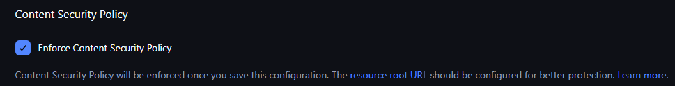
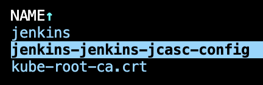
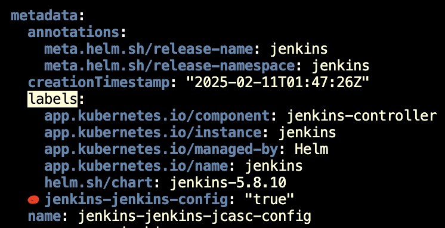
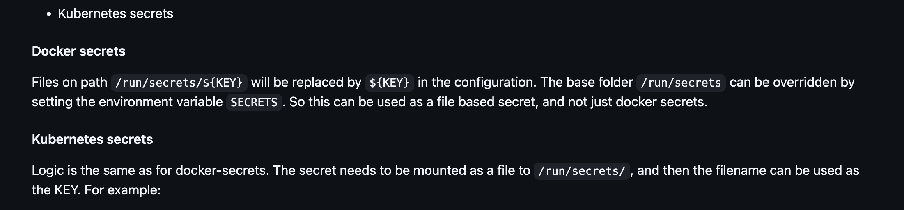
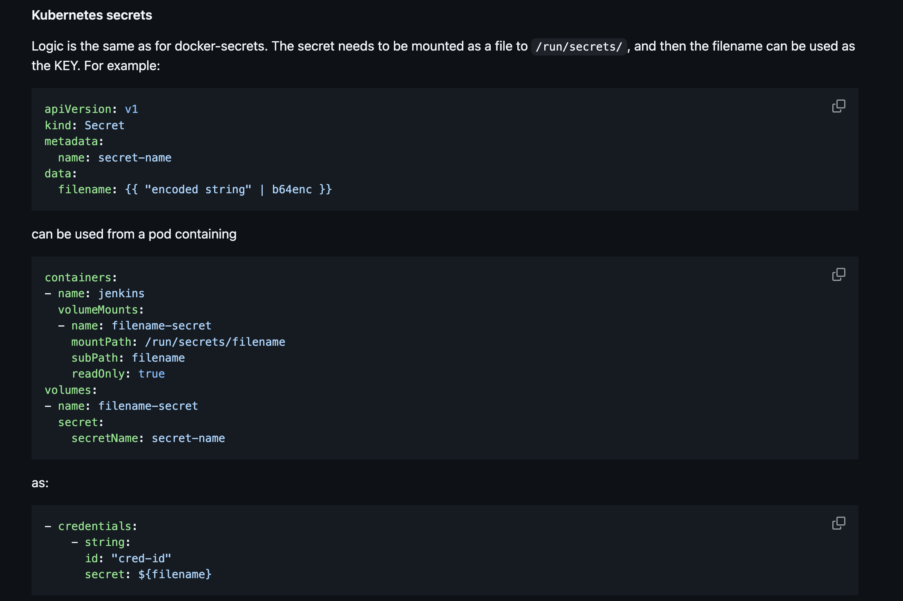

# jenkins

## oidc provider

https://plugins.jenkins.io/oidc-provider/

## job dsl

https://plugins.jenkins.io/job-dsl/

https://jenkinsci.github.io/job-dsl-plugin/

https://your.jenkins.installation/plugin/job-dsl/api-viewer/index.html

## plugins

Jenkins's home dir is persisted by PVC, plugins are persisted in Jenkins's home dir so changing plugins during building docker image of Jenkins does not work.

*NOTE*: *Actual plugin's versions may be changed by applying updates from Jenkins UI, below is just a reference.*

```bash
jenkins-plugin-cli -d /var/jenkins_home/plugins --plugins git
jenkins-plugin-cli -d /var/jenkins_home/plugins --plugins oidc-provider
jenkins-plugin-cli -d /var/jenkins_home/plugins --plugins mask-passwords
jenkins-plugin-cli -d /var/jenkins_home/plugins --plugins pipeline-utility-steps
jenkins-plugin-cli -d /var/jenkins_home/plugins --plugins timestamper
jenkins-plugin-cli -d /var/jenkins_home/plugins --plugins kubernetes
jenkins-plugin-cli -d /var/jenkins_home/plugins --plugins configuration-as-code
jenkins-plugin-cli -d /var/jenkins_home/plugins --plugins saferestart
jenkins-plugin-cli -d /var/jenkins_home/plugins --plugins matrix-auth
jenkins-plugin-cli -d /var/jenkins_home/plugins --plugins google-login
jenkins-plugin-cli -d /var/jenkins_home/plugins --plugins dark-theme
jenkins-plugin-cli -d /var/jenkins_home/plugins --plugins pipeline-graph-view
jenkins-plugin-cli -d /var/jenkins_home/plugins --plugins ssh-agent
```

## How I configured google-login

see [#how-i-config-google-login-and-found-the-way-to-inject-secrets-into-jcasc](#how-i-config-google-login-and-found-the-way-to-inject-secrets-into-jcasc)

## Other stuffs

https://jenkins.tuana9a.com/manage/configureSecurity/#contentSecurityPolicy



# JCasC

This is the JCasC folder inside jenkins master `/var/jenkins_home/casc_configs`

```bash
./generate_jcasc_pipeline.py .jenkins/*.Jenkinsfile > 093-jenkins-JCasC/manifests/jcasc-jobs.yml
```

## How to configure `authorizationStrategy`

https://github.com/jenkinsci/matrix-auth-plugin/blob/50ec01b320a33d7eb2d649bd40bcc97221f50a79/src/test/resources/org/jenkinsci/plugins/matrixauth/integrations/casc/configuration-as-code-v3.yml#L1

## How I found the annotation for auto pickup the config map for jenkins JCasC

I want to make the config auto reload to scan JCasC in configmap instead of puting it directly inside helm values file.

The jenkins use the [kiwigrid/k8s-sidecar](https://github.com/kiwigrid/k8s-sidecar) to enable auto reload

Finding the sidecar will scan the configmaps by [LABEL](https://github.com/kiwigrid/k8s-sidecar/blob/182ed019df9c96326a2808b41ed5c5229281e855/README.md?plain=1#L68)

Inside the jenkins helm template I found this line configuring sidecar <https://github.com/jenkinsci/helm-charts/blob/27ce56f8d366e4759b07d24183352fc0e381c0ba/charts/jenkins/templates/jenkins-controller-statefulset.yaml#L320C14-L320C43>

This lead into this helper file <https://github.com/jenkinsci/helm-charts/blob/27ce56f8d366e4759b07d24183352fc0e381c0ba/charts/jenkins/templates/_helpers.tpl#L606>

Where I found the value of the LABEL is <https://github.com/jenkinsci/helm-charts/blob/27ce56f8d366e4759b07d24183352fc0e381c0ba/charts/jenkins/templates/_helpers.tpl#L626>

`"{{ template "jenkins.fullname" $root }}-jenkins-config"`

So taking a look into existing configmap that used by the sidecar I'm seeing





## How I config google-login and found the way to inject secrets into JCasC

JCasC secrets can be passed using variable

https://github.com/jenkinsci/configuration-as-code-plugin/blob/d6a1291bcdfa50eab8f938ae9c33a3a8fbe5488a/docs/features/secrets.adoc#passing-secrets-through-variables

JCasC secrets with Jenkins running in k8s can be taken from this path /run/secrets/${filename}, or overrided by `SECRETS` env variable

https://github.com/jenkinsci/configuration-as-code-plugin/blob/d6a1291bcdfa50eab8f938ae9c33a3a8fbe5488a/docs/features/secrets.adoc#kubernetes-secrets



Example usage with k8s secrets

https://github.com/jenkinsci/configuration-as-code-plugin/blob/d6a1291bcdfa50eab8f938ae9c33a3a8fbe5488a/docs/features/secrets.adoc#docker-secrets



Jenkins helm chart set `SECRETS` env at `/run/secrets/additional`

https://github.com/jenkinsci/helm-charts/blob/018948716bf31ff168e54a62eba504712010eb21/charts/jenkins/templates/jenkins-controller-statefulset.yaml#L217

is set up here

https://github.com/jenkinsci/helm-charts/blob/018948716bf31ff168e54a62eba504712010eb21/charts/jenkins/templates/jenkins-controller-statefulset.yaml#L310

and pattern is name `path: {{ tpl $value.name $ }}-{{ tpl $value.keyName $ }}`

https://github.com/jenkinsci/helm-charts/blob/018948716bf31ff168e54a62eba504712010eb21/charts/jenkins/templates/jenkins-controller-statefulset.yaml#L383

# argocd

apply

```bash
terraform init
```

```bash
terraform apply
```

## get argocd admin password

```bash
argocd admin initial-password -n argocd
```

```bash
kubectl -n argocd get secret argocd-initial-admin-secret -o jsonpath="{.data.password}" | base64 -d ; echo
```

## port forward for argocd access from dev machine
- terraform apply
- web ui access

```bash
kubectl -n argocd port-forward svc/argocd-server --address ${address:-0.0.0.0} ${port:-8443}:443
```
or
```bash
kubectl -n argocd port-forward svc/argocd-server --address ${address:-0.0.0.0} ${port:-8080}:80
```

## add gke cluster

Need to specify other namespace than default `kube-system` because of

```shell
WARNING: This will create a service account `argocd-manager` on the cluster referenced by context `gke_tuana9a_asia-southeast1_zero` with full cluster level privileges. Do you want to continue [y/N]? y
FATA[0005] Failed to create service account "argocd-manager" in namespace "kube-system": serviceaccounts is forbidden: User "tuana9a@gmail.com" cannot create resource "serviceaccounts" in API group "" in the namespace "kube-system": GKE Warden authz [denied by managed-namespaces-limitation]: the namespace "kube-system" is managed and the request's verb "create" is denied
```

There is a fix https://github.com/argoproj/argo-cd/issues/13054 is to specify other namespace

```bash
ctx=gke_tuana9a_asia-southeast1-a_zero
kubectl config use-context $ctx
argocd cluster add $ctx
```

## add new argo project

```yml
apiVersion: argoproj.io/v1alpha1
kind: AppProject
metadata:
  name: new-project
  namespace: argocd
spec:
  sourceRepos:
    - "*"
  destinations:
    - namespace: "*"
      server: "*"
  clusterResourceWhitelist:
    - group: "*"
      kind: "*"
```

## add digital ocean cluster or any k8s cluster

using service account token as authentication method

```yml
apiVersion: v1
kind: Secret
metadata:
  namespace: argocd
  name: doks-singapore-cluster-creds
  labels:
    argocd.argoproj.io/secret-type: cluster
type: Opaque
stringData:
  name: aca68611-bb11-4a69-a2bb-6029f12a6817.k8s.ondigitalocean.com
  server: https://aca68611-bb11-4a69-a2bb-6029f12a6817.k8s.ondigitalocean.com
  # kubectl -n default create token zeus --duration 30d
  config: |
    {
      "bearerToken": "<kubectl -n default create token zeus --duration=43200m>",
      "tlsClientConfig": {
        "insecure": false,
        "caData": "<base64 cluster ca certificate>"
      }
    }
```
